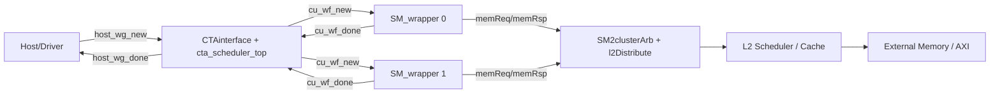
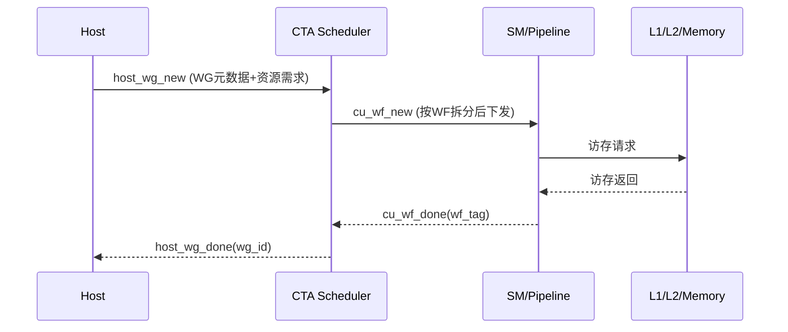

## 1. 这篇文章解决什么问题

刚进入 Ventus 代码时，最常见的问题是：

1. 主链路到底从哪里进、往哪里走？
2. CTA、SM、L1/L2、仿真框架之间如何分工？
3. 后续精读应该先看哪些文件？

这篇总览不追求一次讲透所有细节，而是先建立“可以导航”的全局地图。

## 2. 仓库与代码入口地图

当前学习主路径（以 `ventus-env/gpgpu` 为准）：

- 顶层与参数：`ventus/src/top/`
- CTA 调度：`ventus/src/cta/`
- 执行流水线：`ventus/src/pipeline/`
- 内存系统：`ventus/src/L1Cache/`、`ventus/src/L2cache/`、`ventus/src/mmu/`
- 仿真：`sim-verilator/`

建议先读两个入口文件：

1. `ventus/src/top/GPGPU_top.scala`
2. `ventus/src/top/parameters.scala`

## 3. 全局模块边界



这张图对应了 `GPGPU_top` 的主连接关系：  
主机提交 WG，CTA 调度并拆分为 WF，下发到各 SM；SM 执行后通过访存网络接入 L2；WF 全部完成后回报 Host。

## 4. 从顶层代码看系统骨架

`GPGPU_top.scala` 里最关键的是实例化和互连。下面这段基本能代表“全局骨架”：

```scala
val cta = Module(new CTAinterface)
val sm_wrapper_inst = Seq.tabulate(NSms) { i => Instantiate(new SM_wrapper(FakeCache, SV)) }
val l2cache=VecInit(Seq.fill(NL2Cache)( Module(new Scheduler(l2cache_params)).io))
val sm2clusterArb = VecInit(Seq.fill(NCluster)(Module(new SM2clusterArbiter(l2cache_params_l)).io))
val l2distribute = VecInit(Seq.fill(NCluster)(Module(new l2Distribute(l2cache_params_l)).io))
val cluster2l2Arb = VecInit(Seq.fill(NL2Cache)(Module(new cluster2L2Arbiter(l2cache_params_l,l2cache_params)).io))
```

代码位置：`ventus/src/top/GPGPU_top.scala`

解读重点：

1. `CTAinterface` 是“任务入口 + 波前回收”核心节点。
2. `SM_wrapper` 按 `NSms` 实例化，说明并行 CU/SM 是结构级并行。
3. `SM2clusterArb -> l2Distribute -> cluster2L2Arb -> L2` 表示访存路径是分层仲裁，不是 SM 直连 L2。

## 5. CTA 到 SM 的接口绑定

`CTAinterface` 在顶层里把调度器和 SM 接口“逐字段绑定”，这意味着 CTA 对执行侧的语义定义非常明确：

```scala
cta_sche.io.host_wg_new.valid <> io.host2CTA.valid
cta_sche.io.host_wg_new.ready <> io.host2CTA.ready
...
for (i <- 0 until NUMBER_CU){
  io.CTA2warp(i).valid := cta_sche.io.cu_wf_new(i).valid
  io.CTA2warp(i).bits.dispatch2cu_wf_tag_dispatch := cta_sche.io.cu_wf_new(i).bits.wf_tag
  ...
  cta_sche.io.cu_wf_done(i).bits.wf_tag := io.warp2CTA(i).bits.cu2dispatch_wf_tag_done
}
```

代码位置：`ventus/src/top/GPGPU_top.scala`

这段能看出两点：

1. Host 输入是 WG 级别信息；SM 接收的是 WF 级别信息。
2. `wf_tag` 是“WG/WF 关联键”，后续 CTA 回收依赖它。

## 6. 参数体系如何影响架构

`parameters.scala` 里把“架构规模”和“CTA 配置”集中定义，例如：

```scala
def num_sm = 2
var num_warp = 4
var num_thread = 8
...
object CTA_SCHE_CONFIG {
  object GPU {
    val NUM_CU = num_sm
    val NUM_WG_SLOT = num_block
    val NUM_WF_SLOT = num_warp
  }
}
```

代码位置：`ventus/src/top/parameters.scala`

理解方式：

1. `num_sm / num_warp / num_thread` 决定并行规模与寄存器、缓存等派生参数。
2. CTA 调度器不直接写死规模，而是通过 `CTA_SCHE_CONFIG` 取值，因此可配置性较强。

## 7. 执行链路（从提交到完成）



这个过程的关键在“粒度切换”：

1. Host 与 CTA 交互是 WG 粒度；
2. CTA 与 SM 交互是 WF 粒度；
3. WF 完成后再聚合回 WG 粒度上报。

## 8. 仿真入口与最小可运行路径

在 `sim-verilator/README.md` 里，最直接的路径是：

```bash
make -j run
./build/driver_example/release/sim-VentusRTL -f ventus_args.txt
```

代码/文档位置：`sim-verilator/README.md`

这部分在后续“仿真与测试”章节会展开，当前只需要知道：  
Ventus 有一个 mini driver 可以直接驱动 `libVentusRTL.so`，并通过 `.metadata/.data` testcase 运行。

## 9. 后续精读路线（按依赖顺序）

1. CTA 调度器：`ventus/src/cta/`  
2. Warp/Pipeline：`ventus/src/pipeline/`  
3. 内存系统：`ventus/src/L1Cache/`、`ventus/src/L2cache/`、`ventus/src/mmu/`  
4. 仿真框架：`sim-verilator/`

## 10. 小结

这篇的结论是：Ventus 的主干非常清晰，可以抽象成“WG 输入 -> WF 下发 -> 执行访存 -> WF 回收 -> WG 完成上报”。

下一篇会把这个链路里最关键的前半段展开：  
`cta_scheduler_top` 如何在 `wg_buffer / allocator / resource_table / cu_interface` 四个模块中完成调度闭环。
