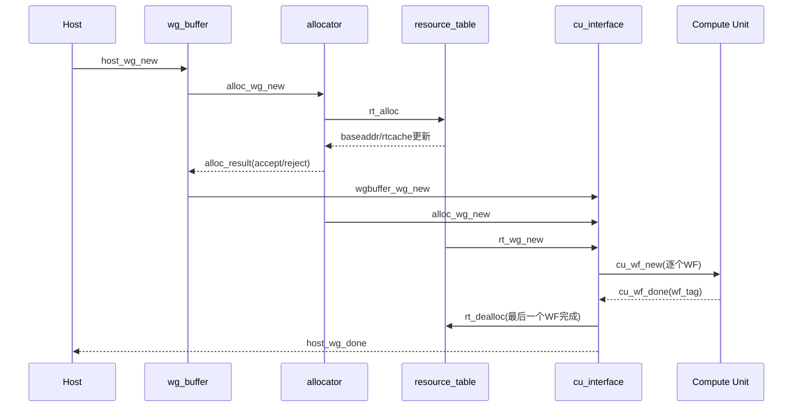

## 1. 这篇文章聚焦的问题

在 Ventus 中，CTA 调度器解决的核心问题是：

1. Host 给了一个 WG，如何判断资源够不够？
2. 资源够时，如何分配到具体 CU 与资源地址？
3. 如何把 WG 拆成多个 WF 下发给 CU？
4. WF 执行完成后，如何回收资源并给 Host 回执？

对应顶层模块：`cta_scheduler_top`（`ventus/src/cta/cta_scheduler.scala`）。

## 2. CTA 调度器总体结构

`cta_scheduler_top` 由 4 个子模块构成：

1. `wg_buffer`
2. `allocator`
3. `resource_table_top`
4. `cu_interface`

关键连接关系（源于 `cta_scheduler_top`）：

```scala
val wg_buffer_inst = Module(new wg_buffer)
val allocator_inst = Module(new allocator)
val resource_table_inst = Module(new resource_table_top)
val cu_interface_inst = Module(new cu_interface)

wg_buffer_inst.io.alloc_wg_new <> allocator_inst.io.wgbuffer_wg_new
allocator_inst.io.wgbuffer_result <> wg_buffer_inst.io.alloc_result
wg_buffer_inst.io.cuinterface_wg_new <> cu_interface_inst.io.wgbuffer_wg_new
allocator_inst.io.cuinterface_wg_new <> cu_interface_inst.io.alloc_wg_new
allocator_inst.io.rt_alloc <> resource_table_inst.io.alloc
resource_table_inst.io.dealloc <> cu_interface_inst.io.rt_dealloc
```

## 3. 端到端数据流图

```mermaid
flowchart LR
  H[Host: host_wg_new] --> W[wg_buffer]
  W --> A[allocator]
  A -->|alloc请求| R[resource_table]
  R -->|baseaddr/rtcache更新| A
  A -->|accept/reject| W
  W -->|完整WG信息| C[cu_interface]
  A -->|cu_id/wg_slot等| C
  R -->|sgpr/vgpr/lds基址| C
  C -->|cu_wf_new| CU[各CU]
  CU -->|cu_wf_done(wf_tag)| C
  C -->|rt_dealloc| R
  C -->|host_wg_done| H
```

调度闭环可以简化为两条环：

1. 分配环：`wg_buffer -> allocator -> resource_table -> allocator -> wg_buffer`
2. 执行回收环：`cu_interface -> CU -> cu_interface -> resource_table/host`

## 4. 模块一：wg_buffer（入口排队 + WG 信息拆分）

代码位置：`ventus/src/cta/wg_buffer.scala`

### 4.1 为什么要有两份 WGRAM

`wg_buffer` 把同一个 WG 分为两类信息存储：

1. `wgram1`：给 `allocator` 的资源相关信息
2. `wgram2`：给 `cu_interface` 的执行相关信息

关键代码：

```scala
val wgram1 = Mem(NUM_ENTRIES, new ram1datatype)
val wgram2 = Mem(NUM_ENTRIES, new io_buffer2cuinterface)
val wgram_valid = RegInit(Bits(NUM_ENTRIES.W), 0.U)
val wgram_alloc = RegInit(Bits(NUM_ENTRIES.W), 0.U)

val wgram_wr_next = RRPriorityEncoder(~wgram_valid)
val wgram1_rd_next = RRPriorityEncoder(wgram_valid & ~wgram_alloc)
```

解读：

1. `wgram_valid` 表示槽位有无有效 WG。
2. `wgram_alloc` 表示该 WG 是否正在被 allocator 处理。
3. 两个 RR 编码器分别控制“写入空槽”和“读取待分配 WG”，避免固定优先级饥饿。

### 4.2 接受/拒绝的行为差异

allocator 返回 `alloc_result` 后：

1. `accept=true`：读出 `wgram2`，送往 `cu_interface`，同时清除槽位。
2. `accept=false`：只清 `wgram_alloc`，保留 WG，等待下次再尝试分配。

因此，拒绝不会丢任务，只会延迟调度。

## 5. 模块二：allocator（核心决策机）

代码位置：`ventus/src/cta/allocator.scala`

### 5.1 主状态机

allocator 主 FSM：

```scala
object FSM extends ChiselEnum {
  val IDLE, CU_PREFER, RESOURCE_CHECK, ALLOC, REJECT = Value
}
```

语义：

1. `IDLE`：等 WG。
2. `CU_PREFER`：选起始 CU（偏向上次分配后继 CU）。
3. `RESOURCE_CHECK`：检查目标 CU 资源是否满足。
4. `ALLOC`：确认并发起分配。
5. `REJECT`：本次无法分配，通知 `wg_buffer` 保留重试。

### 5.2 rtcache_writer：分配与回写冲突处理

allocator 对 `rt_result_*`（来自 resource table 的资源扫描结果）和“本地正在分配”之间做仲裁：

```scala
io.rt_result.ready := !io.alloc_en || (!alloc_wr && (io.rt_result.bits.cu_id =/= io.alloc_cuid))
io.rtcache_wr_en := io.rt_result.fire || alloc_wr
when(alloc_wr) {
  io.rtcache_wr_data.size(i) := io.alloc_rawdata.size(i) - Mux(i.U === io.alloc_sel, io.alloc_size, 0.U)
} .elsewhen(io.rt_result.fire) {
  io.rtcache_wr_data.size := io.rt_result.bits.size
}
```

关键点：  
分配临界窗口里会锁住当前 CU 的 cache 写入，避免“边分配边被外部结果覆盖”。

### 5.3 线程索引基址计算流水

allocator 不只做“资源够不够”判断，还负责生成 WG 的 `threadIdx` 基址与网格尺度：

```scala
object THREADIDX_FSM extends ChiselEnum {
  val IDLE_CALC0, CALC1_STORE0, CALC2_STORE1, STORE2, OK = Value
}
...
threadIdx_mul1.io.a := wg.wgIdx_x
threadIdx_mul1.io.b := wg.num_thread_per_wg_x
...
threadIdx_result_base_x := threadIdx_mul1.io.result
threadIdx_result_gsize_x := threadIdx_mul2.io.result
```

这块是后续 `cu_interface` 生成 threadIdx in grid 的基础输入。

## 6. 模块三：resource_table（资源地址管理）

代码位置：`ventus/src/cta/resource_table.scala`

### 6.1 数据结构：按资源地址排序的链表

以每个 CU 的每类资源（LDS/SGPR/VGPR）为单位，维护链式结构：

```scala
class io_rtram(NUM_RESOURCE: Int, NUM_WG_SLOT: Int = CONFIG.GPU.NUM_WG_SLOT) extends Bundle {
  val prev  = new io_ram(NUM_WG_SLOT, UInt(...))
  val next  = new io_ram(NUM_WG_SLOT, UInt(...))
  val addr1 = new io_ram(NUM_WG_SLOT, UInt(...))
  val addr2 = new io_ram(NUM_WG_SLOT, UInt(...))
  val cnt  = new io_reg(1, UInt(...))
  val head = new io_reg(1, UInt(...))
  val tail = new io_reg(1, UInt(...))
}
```

含义：

1. 每个 WG slot 是链表节点。
2. `addr1/addr2` 给出该 WG 占用资源段。
3. 分配时在“空闲段”里找可容纳位置；释放时把节点摘除并合并可用空间语义。

### 6.2 ALLOC 子流程的核心思想

`FSM_A.FIND` 以流水线方式扫描空闲段，寻找“够用且最小”的段：

```scala
val size = WireInit(UInt(...), addr2 - addr1)
val result_update = (size >= wgsize) && (size < fsm_a_found_size)
fsm_a_found_size := Mux(fsm_a_valid_p1 && result_update, size, fsm_a_found_size)
fsm_a_found_addr := Mux(fsm_a_valid_p1 && result_update, addr1 + 1.U, fsm_a_found_addr)
```

这是典型的 best-fit 倾向（在扫描范围内取最小可用段），有助于降低碎片。

## 7. 模块四：cu_interface（WG->WF 拆分与回收）

代码位置：`ventus/src/cta/cu_interface.scala`

### 7.1 三路信息汇合

`cu_interface` 只有在三路输入都 valid 时才入队：

```scala
io.wgbuffer_wg_new.ready := io.alloc_wg_new.valid && io.rt_wg_new.valid && fifo.io.enq.ready
io.alloc_wg_new.ready := io.wgbuffer_wg_new.valid && io.rt_wg_new.valid && fifo.io.enq.ready
io.rt_wg_new.ready := io.wgbuffer_wg_new.valid && io.alloc_wg_new.valid && fifo.io.enq.ready
fifo.io.enq.valid := io.wgbuffer_wg_new.valid && io.alloc_wg_new.valid && io.rt_wg_new.valid
```

这保证了一个 WG 的执行信息、分配信息、资源基址信息不会错配。

### 7.2 WG 拆 WF 的关键状态量

```scala
val splitter_cnt = RegInit(0.U(...))
val splitter_sgpr_addr = Reg(UInt(...))
val splitter_vgpr_addr = Reg(UInt(...))
val splitter_pds_addr = Reg(UInt(...))
...
io.cu_wf_new(i).bits.wf_tag := {
  val wftag = Wire(new wftag_datatype)
  wftag.wg_slot_id := fifo.io.deq.bits.wg_slot_id
  wftag.wf_id := fifo.io.deq.bits.num_wf - splitter_cnt
  wftag.asUInt
}
```

要点：

1. `splitter_cnt` 表示尚未下发的 WF 数。
2. SGPR/VGPR/PDS 基址在每次 WF 下发后递增。
3. `wf_tag = {wg_slot_id, wf_id}`，用于完成回收时定位 WG。

### 7.3 WF 回收与 WG 完成判定

`cu_wf_done` 通过 RRArbiter 汇总后，更新 `wf_gather_cnt`：

```scala
val wf_gather_finish = (wf_gather_cnt_read_data + 1.U === wf_gather_ram_read_data.num_wf)
io.rt_dealloc.valid := (fsm === FSM.UPDATE && wf_gather_finish) || (fsm === FSM.DEALLOC && !rt_dealloc_ok)
io.host_wg_done.valid := (fsm === FSM.UPDATE && wf_gather_finish) || (fsm === FSM.DEALLOC && !host_wg_done_ok)
```

当最后一个 WF 完成时，同时触发两条动作：

1. 向 resource_table 发 `rt_dealloc`
2. 向 host 发 `host_wg_done`

## 8. 关键时序（从新 WG 到回收）



## 9. 调试与验证建议

1. 先看 `wg_id` 和 `wf_tag` 是否自洽（很多模块 debug 分支都保留了 `wg_id`）。
2. 关注 `accept=false` 的路径，确认 WG 会被重试而不是丢弃。
3. 在 `cu_interface` 观察 `splitter_cnt`、`wf_gather_cnt` 是否一发一收闭环。
4. 对照 `sim-verilator/testcase` 运行小规模 case（如 vecadd）先验证流程通，再看性能。

## 10. 小结与下一步

CTA 调度器的本质是“任务缓冲 + 资源决策 + 执行切片 + 完成聚合”四段式流水。  
其中最关键的关联键是 `wg_slot_id/wf_tag`，它把分配、下发、完成、回收串成一个闭环。

下一篇将进入执行侧：  
从 `warp_schedule`、`scoreboard` 到 `issue/execution/writeback`，梳理 Ventus Pipeline 的控制主线。
